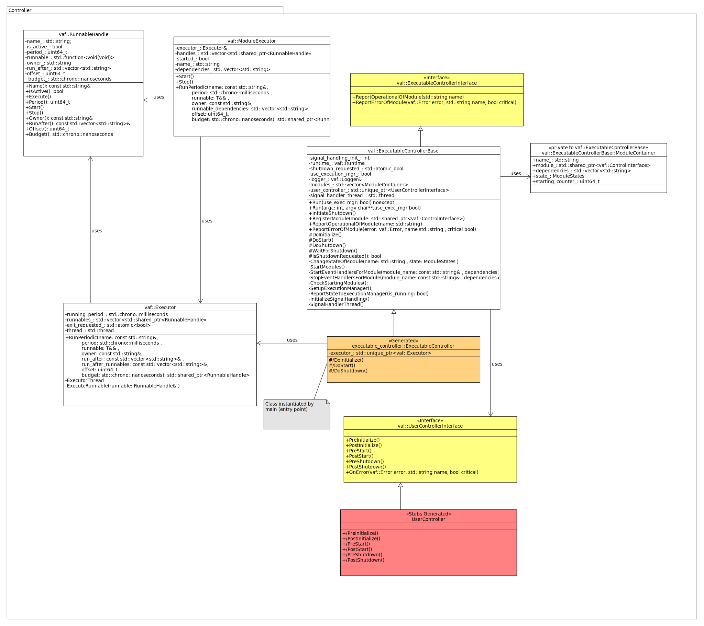
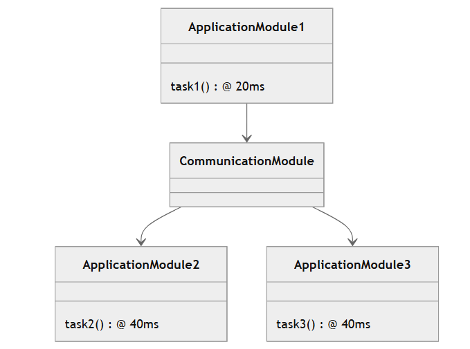
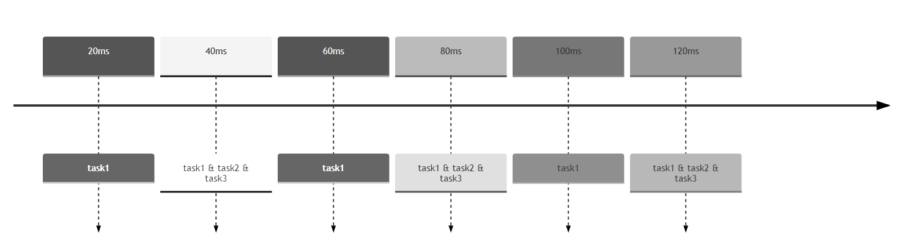
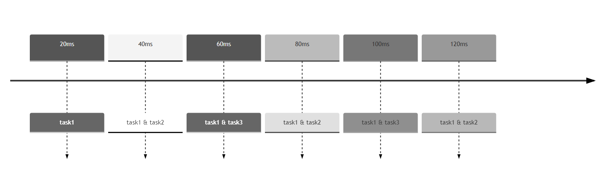
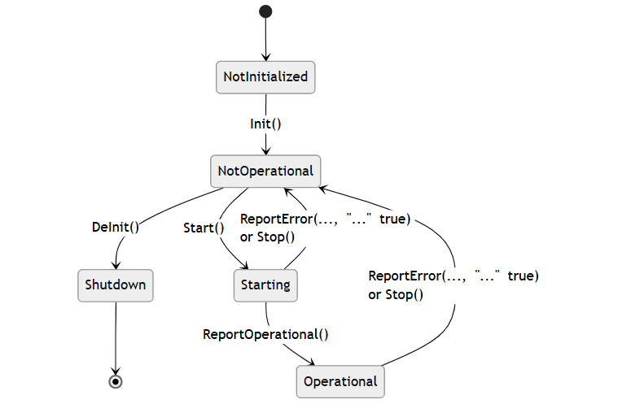
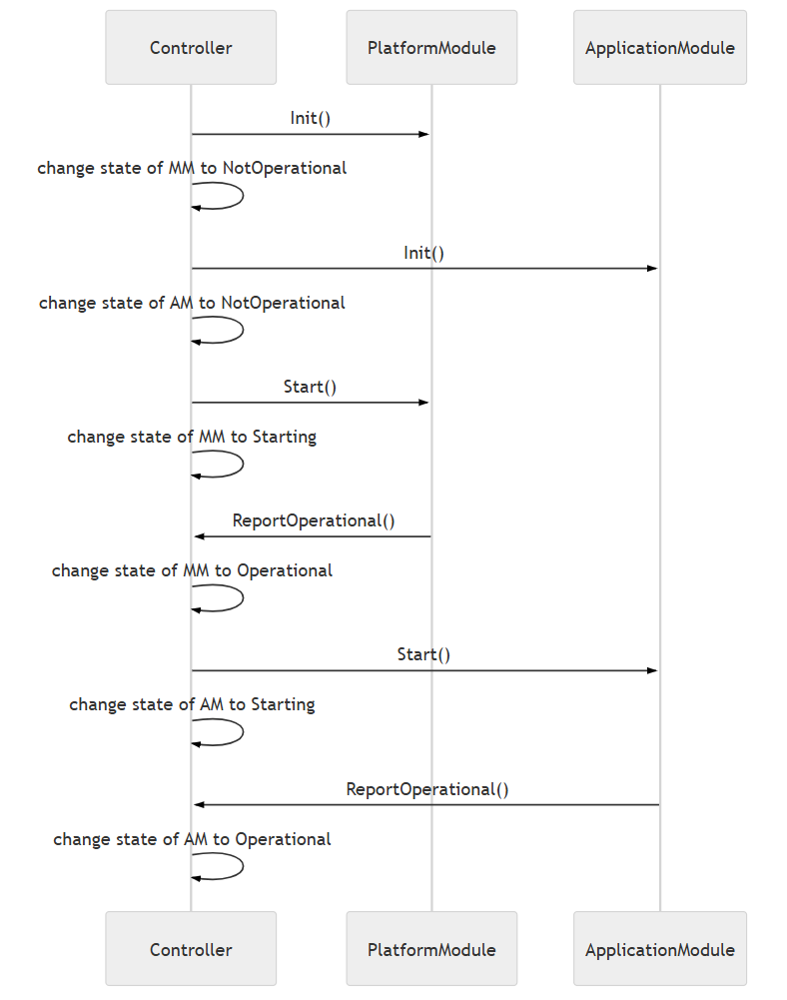
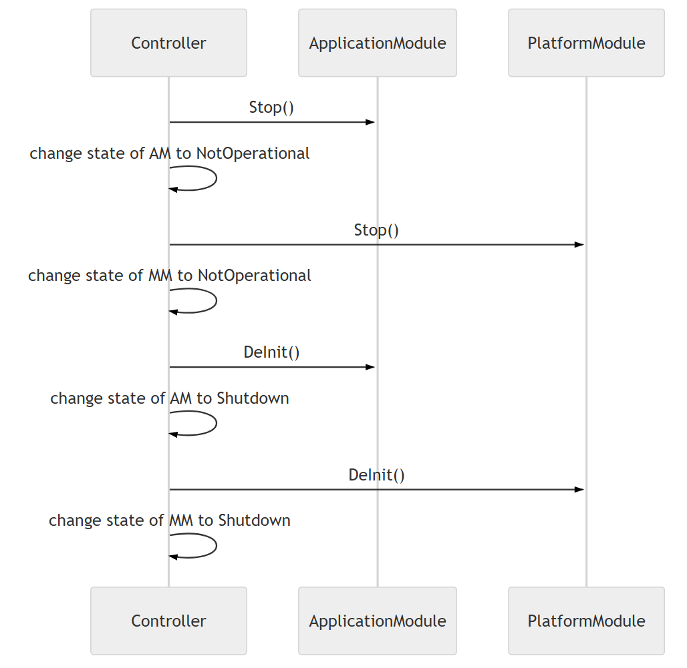
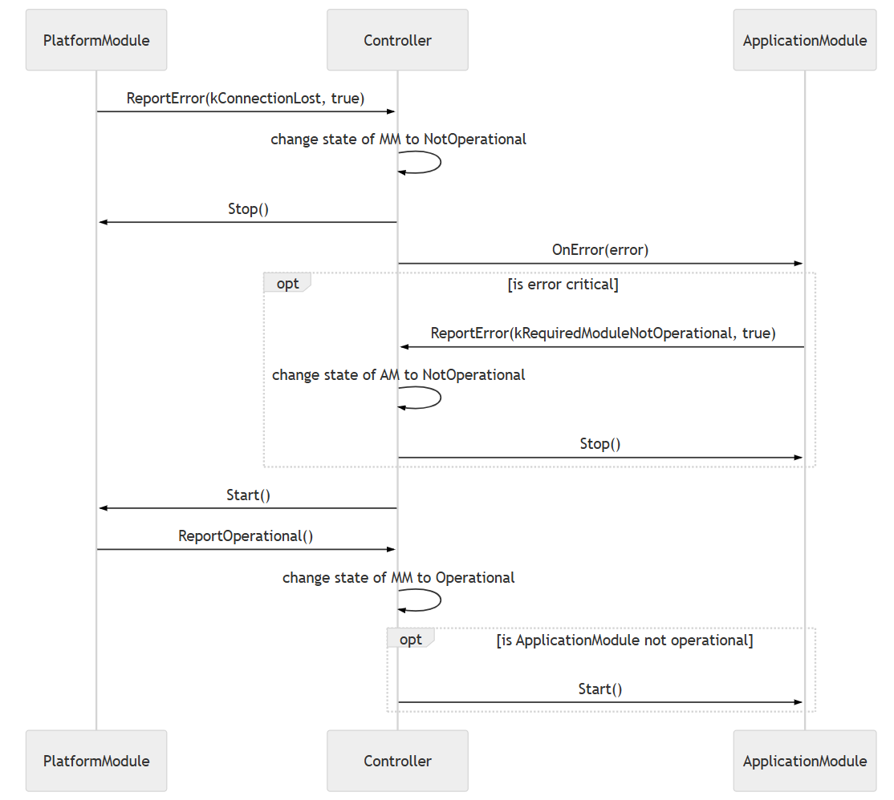

..
   # *******************************************************************************
   # Copyright (c) 2024 Contributors to the Eclipse Foundation
   #
   # See the NOTICE file(s) distributed with this work for additional
   # information regarding copyright ownership.
   #
   # This program and the accompanying materials are made available under the
   # terms of the Apache License Version 2.0 which is available at
   # https://www.apache.org/licenses/LICENSE-2.0
   #
   # SPDX-License-Identifier: Apache-2.0
   # *******************************************************************************

VAF software library (vafcpp)
=============================

The vafcpp library is the core library and static code part of the
Vehicle Application Framework (VAF). It covers abstraction of required
primitives such as future, promise, data pointer, error, and logging.
Beyond that, it contains the basic framework for the execution of
application and platform communication modules. The execution framework
is mainly divided into an executor (see `executor.h <../../../../docs/doc/application_framework/contents/code/executor.h>`__)
and an executable controller class (see `executable_controller_base.h <../../../../docs/doc/application_framework/contents/code/executable_controller_base.h>`__).

An instance of the executable controller class is created in the main
function of every VAF executable, where it acts as entry point for
execution. An instance of the executor class, which manages the periodic
execution of the tasks of application and communication modules, is a
direct member of this executable controller. All tasks that shall be
scheduled by an executor are accessible via so-called task handles. All
tasks of one module are linked to a corresponding module executor. The
overall structure of the executor and executable controller is given
below:

Executor
--------

The executor ensures periodic task execution (see
`executor.h <../../../../docs/doc/application_framework/contents/code/executor.h>`__).
The period can be configured with the *ExecutorPeriod* parameter in the
executable configuration. Tasks are processed while considering module
dependencies. That is, if an application module A depends from
application module B, the tasks of module B are always executed before
the ones of module A in one time slot. Since the executor works with
time slots, it maps the tasks deterministically into the same slot. To
avoid situations, where many tasks are mapped to the same time slot, it
is possible to configure tasks with an offset.

Runtime monitoring
------------------

Each task can have a budget assigned to it. The executor will monitor
the execution time of a task and log any violation of its budget. Also
the runtime of the executor time slot is monitored and if tasks in one
slot exceed their budget, a warning is logged.

**Example**

.. raw:: html
   
         

Consider the example with three application modules with one task each
and an executor period of 20ms (see figure below).

.. raw:: html
   
         

Every second cycle, the executor has to execute all three tasks in one
time slot. For a better load distribution, one can add an offset of 1
(cycle) to task3 as depicted in the next figure.

Future/Promise
--------------

The abstraction of *Future* and *Promise* primitives is encapsulated by
the ``vaf::Future`` and ``vaf::Promise`` namespaces respectively. For
details see `future.h <../../../../docs/doc/application_framework/contents/code/future.h>`__.

Data pointer
------------

Two types of data pointers are used in VAF. First one is
``vaf::DataPtr``, a data pointer type where the data can be changed.
Second one is ``vaf::ConstDataPtr``, where the data is fixed. The
underlying type of a ``vaf::DataPtr`` or a ``vaf::ConstDataPtr`` is not
fixed. For the ``vaf::DataPtr`` case the underlying type can be a
platform-specific type, for example ``std::unique_ptr``. Same holds for
the ``vaf::ConstDataPtr`` case, which also maps to ``std::unique_ptr``
for example. See `data_ptr.h <../../../../docs/doc/application_framework/contents/code/data_ptr.h>`__
for the details.

Error
-----

The abstraction of error codes, i.e., ``vaf::Error``, is implemented in
`error_domain.h <../../../../docs/doc/application_framework/contents/code/error_domain.h>`__.

Error reporting
~~~~~~~~~~~~~~~

Modules can report errors via
``ReportError(ErrorCode error_code, std::string msg, bool critical = false)``.
See `controller_interface.h <../../../../docs/doc/application_framework/contents/code/controller_interface.h>`__.
If ``critical`` is set to *true*, the state of the module changes to
*not operational*. Errors are further propagated to other modules that
depend on the module in question.

ExecutableController
--------------------

| The executable controller manages the states of the application and communication modules (see `executable_controller_base.h <../../../../docs/doc/application_framework/contents/code/executable_controller_base.h>`__).
| The following state machine defines the *states and* state
  transitions\* of a module:

.. raw:: html
   
         

The following methods trigger a **state transition**: - Init() - Called
at startup. - DeInit() - Called at shutdown. - Start() - Called when all
required modules are operational. - Will enable executor tasks. - Stop()
- Called when the module reports an error or before shutdown. - Will
disable executor tasks and receive handlers. - ReportOperational() -
Called by the module, if starting was successful or an error was
recovered. - Will enable receive handler. - ReportError(…, “…” true) -
Called if the module detects an error (makes the module unusable for
other modules). - Will disable executor tasks and receive handlers. -
Will call OnError() on all modules that depend on the module.

The following sequence diagram shows the **startup** of communication
and application modules by the executable controller:

.. raw:: html
   
         

The following sequence diagram shows the **shutdown** of platform and
application modules by the executable controller:

.. raw:: html
   
         

The following sequence diagram shows the **normal operation** of
platform and application modules in interaction with the executable
controller:

Logging
-------

Logging functionality is encapsulated by the ``vaf::Logger`` namespace.
For details see `logging.h <../../../../docs/doc/application_framework/contents/code/logging.h>`__.
