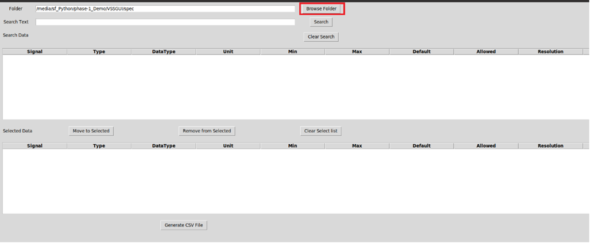
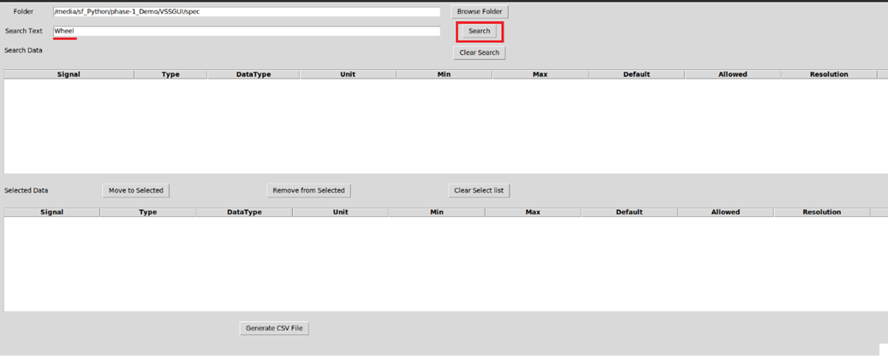
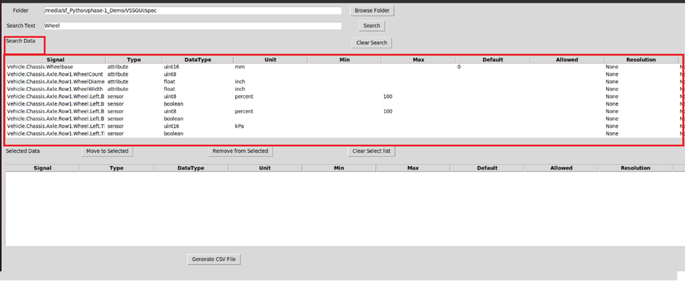
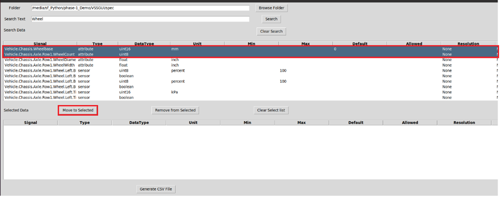
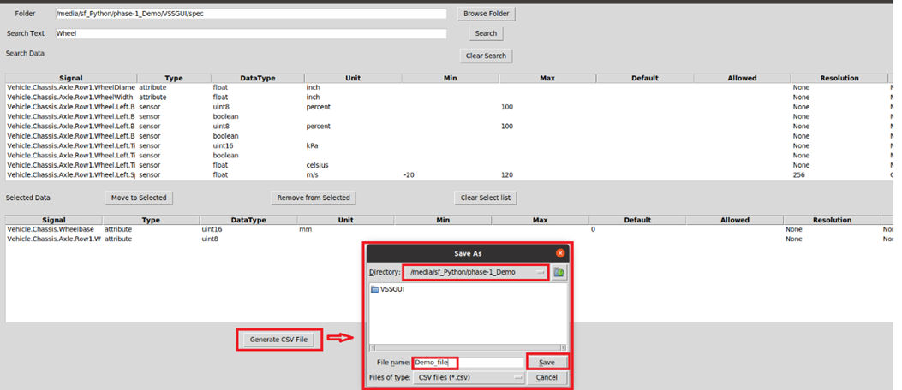
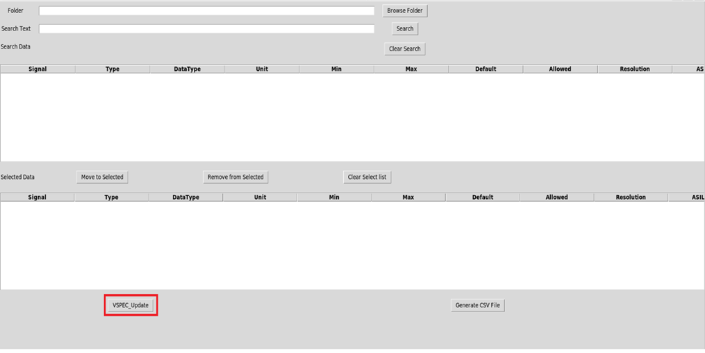
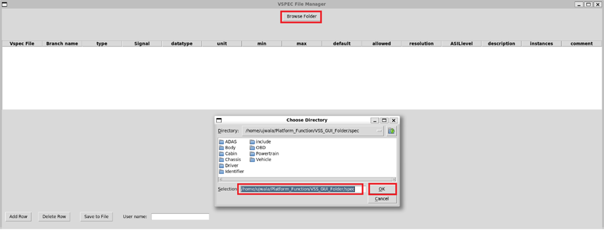
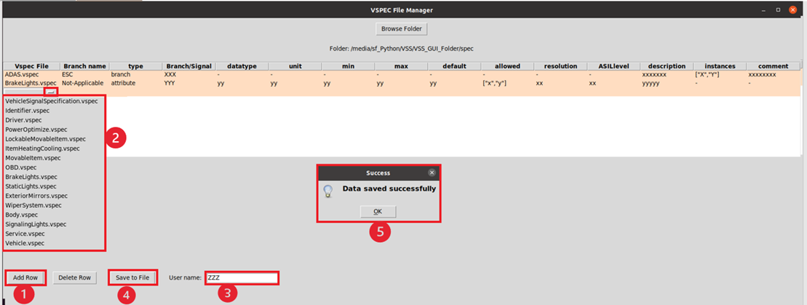

..
   # *******************************************************************************
   # Copyright (c) 2024 Contributors to the Eclipse Foundation
   #
   # See the NOTICE file(s) distributed with this work for additional
   # information regarding copyright ownership.
   #
   # This program and the accompanying materials are made available under the
   # terms of the Apache License Version 2.0 which is available at
   # https://www.apache.org/licenses/LICENSE-2.0
   #
   # SPDX-License-Identifier: Apache-2.0
   #
   # Contributors:
   #   Thomas Pfleiderer - first documentation
   # *******************************************************************************

Steps to Use the GUI Tool
=========================

Execute the Python ``vss_gui.py`` script.

Signal Selection
----------------

1. Provide the path for .vspec files ``scripts\vss\vspec`` through the **Browse Folder** button. 
   
   |Select .vspec file|

2. Search for the required signal in **Search** button. 
   
   |Search for signal|

3. List of all signals that match the search criteria are listed in the **Search Data** pane along with the respective attributes. 
   
   |Search pane result|
   
4. Select the required signals and move them to **Selected Data** pane by clicking the **Move to Selected** button. 
   
   |Move to selected|
   
5. Similarly select the other required signals for the application and generate the .csv file by clicking the **Generate CSV File** button. 
   
   |Generate CSV|
   
Signal Creation
---------------

1. To create a new signal, select the **VSPEC_Update** button. 
   
   |VSPEC update|

2. **VSPEC File Manager** window will be opened and select the spec folder path to be updated using the **Browse Folder** button.
   
    |Browse folder|

3. Add signal/branch by selecting the **Add Row** button. It is necessary to select branch, type, and the relevant attributes of the signal. Provide also the username to save the data into files. 
   
   |Data saved|

