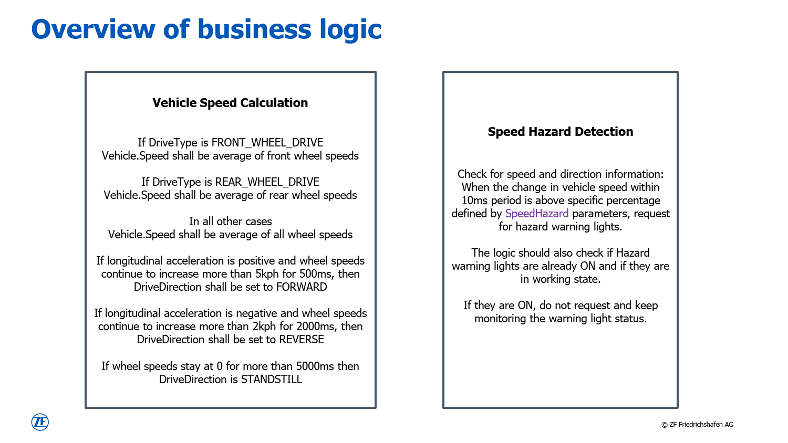

# Blueprint project (VSS + VAF)

This blueprint project illustrates the combined usage of the VSS editing tool (as contributed by ZF
Group) and the Application Framework (as contributed by Vector Informatik GmbH).

## Overview
An overview of the sample application for this project is given in the figure below.

## VSS catalogue
The signal definitions partly originate from the original VSS catalogue and are marked in gray. New, and
therefore custom signals for this application, are added to the same structure by using the
[vss-gui-tool](https://github.com/eclipse-autoapiframework/vss-gui-tool), which is part of this
Eclipse project. Those are marked in blue and purple.

The outcome of this step is filed in JSON format and located in model folder of this blueprint
project (see [vss-sample-zf.json](./model/vss/vss-sample-zf.json)).

From here, the
[application-framework](https://github.com/eclipse-autoapiframework/application-framework) for
design, implementation, and test of this application.

## VAF interface project
This file is consumed as input artifact by the VAF interface project. Based on the catalogue, the
following interfaces are defined in the Config as Code file [interfaces.py](./Interfaces/interfaces.py):
* SpeedIf
* SpeedCalculationIf
* HazardIf
* HazardDetectionIf

Finally, the complete interface definition gets exported to the VAF model format in JSON.

## Application modules
The model is used as input for the application module projects. For this project, there are two of
them to realize the functionality:
* [VehicleSpeedCalculation](./VehicleSpeedCalculation/)
* [SpeedHazardDetection](./SpeedHazardDetection/)

Those projects hold the actual implementation of the business logic, which is specified in the
figure below. Also unit tests with Google Test are possible and supported by the Application
 Framework as part of this project. 

On top, a third application module ([TestModule](./TestModule/)) is created. It is used later to
connect to the open ends of the arrows as illustrated above and by that allow testing.

## Integration project
The final project is the [Integration project](./IntegrationProject/). This is where the above
application modules get instantiated and connected among each other. This project provides two
flavors.
* Integration of all modules in one executable. See
  [integration_project.py](./IntegrationProject/model/vaf/integration_project.py) for the details.
* Integration of [VehicleSpeedCalculation](./VehicleSpeedCalculation/) and
  [SpeedHazardDetection](./SpeedHazardDetection/) in one executable and [TestModule](./TestModule/)
  in a separate one. The connection between the them is realized via Vector SIL Kit. See
  [integration_project_silkit.py](./IntegrationProject/model/vaf/integration_project_silkit.py) for
  the details.

To switch between the two variants, modify the file
[model.py:11-12](./IntegrationProject/model/vaf/model.py) accordingly and trigger the following two
commands afterwards to re-generate and re-build the application:
* vaf model generate
* vaf make install
